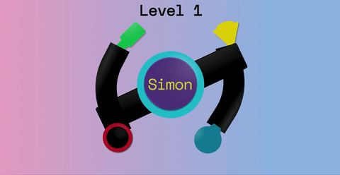
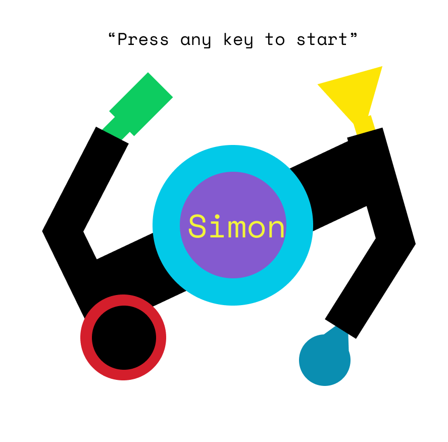
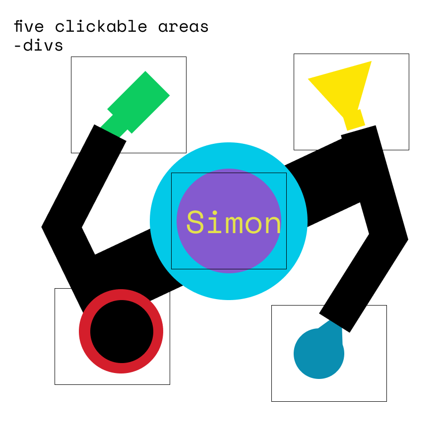
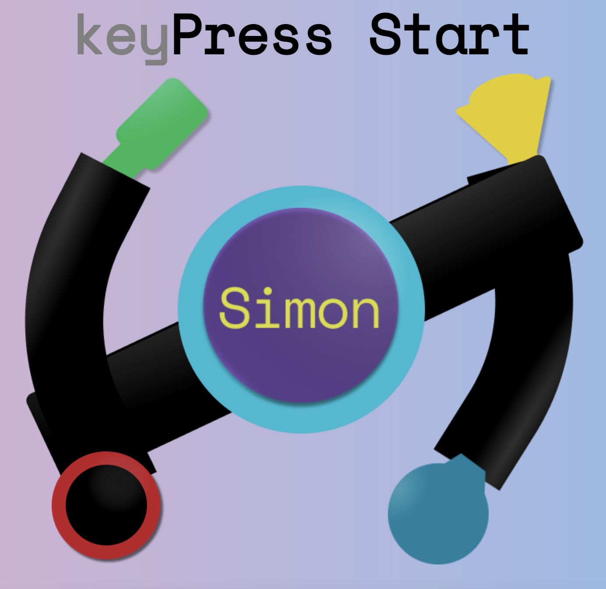
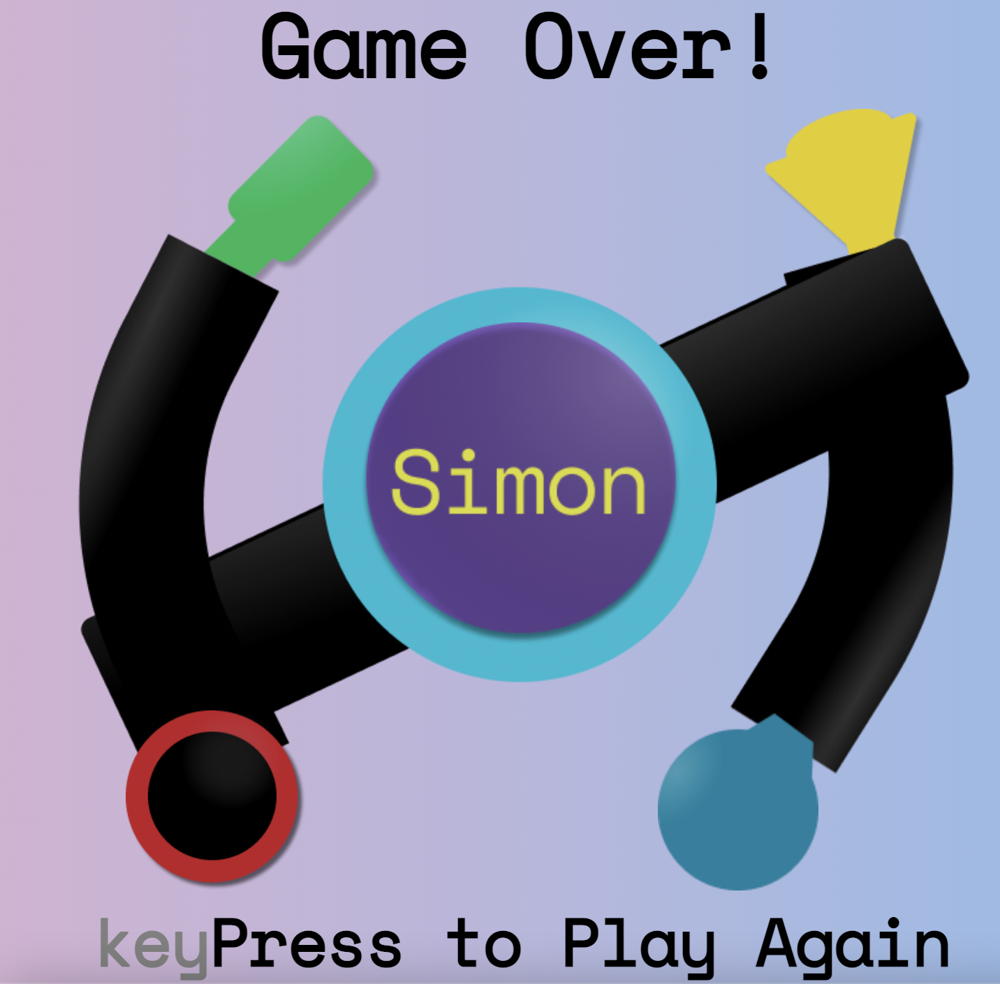

# Simon Bops

### Project 1 for General Assembly's remote Software Engineering Immersive program

> Simon Bops is a remix of the iconic Hasbro memory game with a vintage Bop It! UI. The game is a test of memory, with the computer (aka Simon) generating a random sequence of colors, which the user will attempt to match.

# Screenshot

# Technologies Used

### Organization / Guidance

- Trello
- Discord
- Slack
- Zoom
- Microsoft OneNote

### Design

- Figma

### Development

- VS Code
- Google Chrome + Developer Tools
- Mozilla Firefox + Developer Tools

# Installation Instructions

> N/A

# User Stories

## Who They Are

- Simon
- Player

## What They Want

- wait to play until the opponent is ready
- to know what color is being played by Simon
- to store the player's input
- to know what level they're on
- tell the player that the current game is over

## Why They Want It

- don't want to start the game until the player is ready to play
- know what colors to remember
- know how to check scores
- know whether or not they're beating Simon
- they can restart the game if they wanted to

### Bronze Priorities

- store the input of the player
- store the game sequence
- use corresponding numbers to flash components
- display current level
- create a random sequence
- inform user if the game is over
- if the game is over, reset settings
- increment levels with each correct match
- cross-check matches for game score verification
- display Simon's colors at the start of each level

### Silver Priorities

- add indicators to corresponding moves (highlight, sound, or animation)
- don't start the game until player tells it to

### Gold Priorities

- polish CSS grid
- CSS animations

# Wireframes

## Major Views

## Interface

# Unsolved Problems / Major Hurdles

CSS Grid wasn't covered at this point of the course, so it took a lot of trial, error, and helpful YouTube videos to get the piece overlapping in a way that matched my wireframe. I wanted to implement animations to simulate the Bop It! game. I tried a couple of different CSS animation libraries, but after breaking my code a few times, I stuck it out with the helpful folks at animate.css and was able to overcome that hurdle. The JS is as DRY as I could make it, with lots of learning on semi-new method concepts such as Promises and Audio.

### References/Credits:

- https://animate.style/
- https://cssgradient.io/
- https://css-tricks.com/almanac/properties/f/filter/
- https://codepen.io/fitri/pen/NjbMRV?editors=0010
- https://developer.mozilla.org/en-US/docs/Web/API/Node/removeChild
- https://iconhandbook.co.uk/reference/examples/favicons/
- https://www.sounds-resource.com/mobile/bopit/sound/23632/
- https://stackoverflow.com/questions/45498873/add-a-delay-after-executing-each-iteration-with-foreach-loop
- https://www.udemy.com/course/the-complete-web-development-bootcamp/
- https://www.w3schools.com/jsref/prop_style_filter.asp
- https://www.w3schools.com/JSREF/prop_style_display.asp
- https://www.w3schools.com/tags/av_prop_volume.asp
- https://www.w3schools.com/jsref/met_audio_play.asp
- https://www.w3schools.com/jsref/met_element_getattribute.asp
- https://www.w3schools.com/jsref/met_win_settimeout.asp
- https://www.youtube.com/watch?v=br-0i3U1VCA
- https://www.youtube.com/watch?v=EashgVqboWo&feature=emb_title
- https://www.youtube.com/watch?v=0Gr1XSyxZy0
- Last but not least, the GA Instructors for the SEIR-201 course and my very supportive cohort
